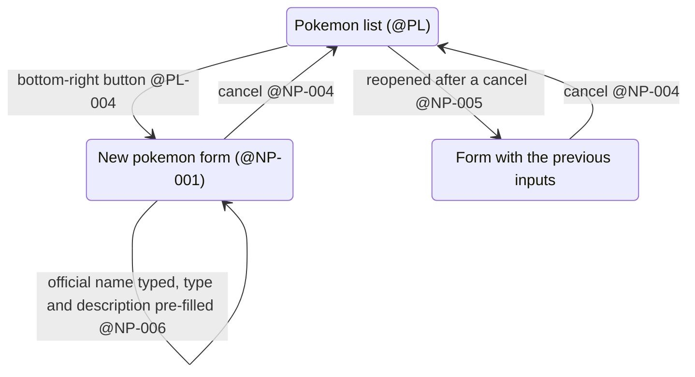

# New pokemon: form workflow

Used by `docs/business/NP-new-pokemon.md`.

```mermaid
stateDiagram-v2
    List: Pokemon list (@PL)
    Form: New pokemon form (@NP-001)
    Restored: Form with the previous inputs

    List --> Form: bottom-right button @PL-004
    Form --> List: cancel @NP-004
    List --> Restored: reopened after a cancel @NP-005
    Restored --> List: cancel @NP-004
    Form --> Form: name or type missing @NP-002
    Form --> Form: official name typed, type and description pre-filled @NP-006
```
