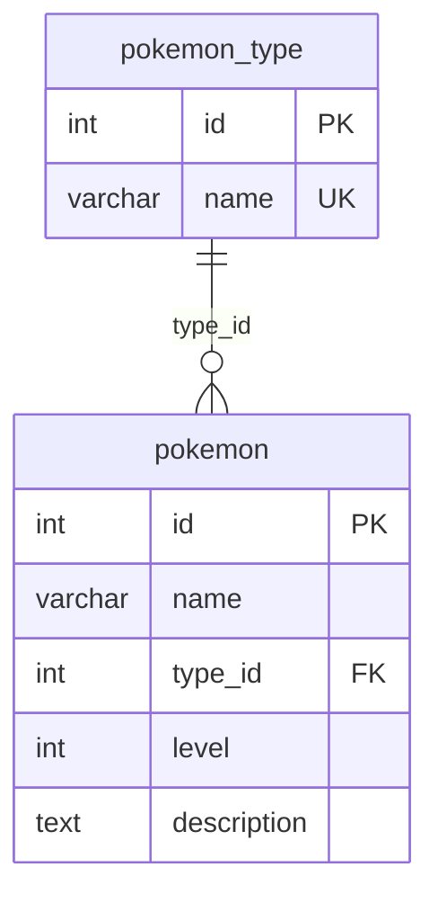

<!-- Generated from schema.sql. Never edit by hand. -->

# Database schema

```mermaid
erDiagram
    pokemon_type {
        int id PK
        varchar name UK
    }
    pokemon {
        int id PK
        varchar name
        int type_id FK
        int level
        text description
    }
    pokemon_type ||--o{ pokemon : "type_id"
```
